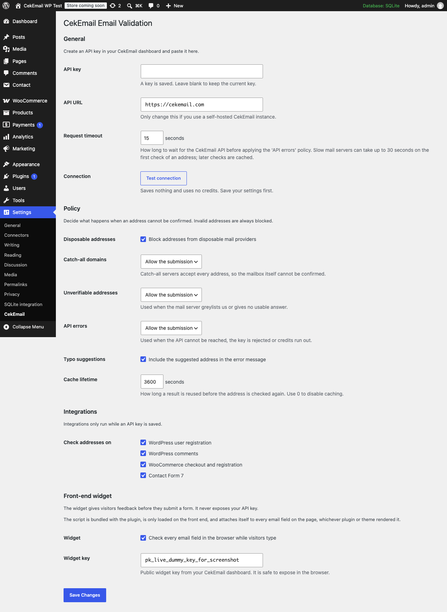
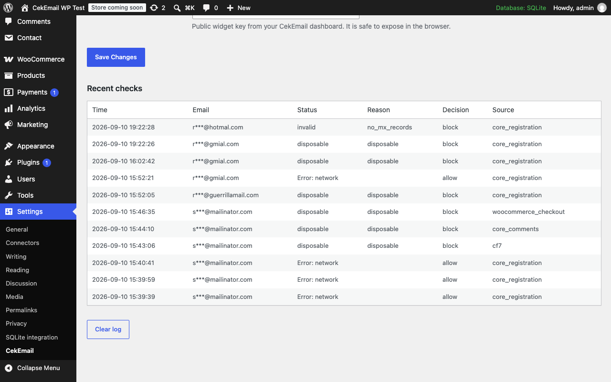

# CekEmail Email Validation for WordPress

CekEmail Email Validation checks every email address submitted to your WordPress site against the [CekEmail](https://cekemail.com) API before WordPress stores it. It covers WordPress user registration, comments, WooCommerce checkout and account registration, and Contact Form 7 email fields. Each address is checked for a valid format, a reachable mail server, a real mailbox, and whether it belongs to a disposable provider, so invalid, undeliverable, disposable and mistyped addresses are stopped at the door. An optional front-end widget shows visitors the result while they type, before the form is submitted.

## Features

- Invalid addresses are always blocked.
- Disposable addresses are blocked, or allowed, as you prefer.
- Catch-all domains, unverifiable mailboxes and API errors each get their own allow or block policy, so a hiccup at the API never has to lock visitors out.
- Supported forms:
  - WordPress user registration.
  - WordPress comments.
  - WooCommerce checkout, both the classic shortcode checkout and the block checkout.
  - WooCommerce account registration.
  - Contact Form 7 email fields, required and optional.
- An optional front-end widget, bundled with the plugin and never loaded from a CDN, that checks every email field on the page while the visitor types and shows the result before the form is submitted. It uses a public widget key, never your API key.
- Typo suggestions ("did you mean ...") in the error message.
- Result caching, so the same address is not billed twice within the cache lifetime.
- A "Test connection" button that validates your API key without spending credits.
- A log of the 50 most recent checks, with addresses masked.
- Admin notices when your key is rejected or your credits run out.
- Filters and actions so developers can extend or override every decision.

## Screenshots



*The settings screen, with the API key, policy and integration options.*



*The recent checks log.*

## Requirements

- WordPress 6.4 or later
- PHP 8.0 or later
- A CekEmail account and API key

## Installation

The WordPress.org listing is pending. Until it is live, install the plugin from a ZIP:

1. Download the latest ZIP from [GitHub Releases](https://github.com/cekemail/wordpress-plugin/releases) or from https://static.cekemail.com/wordpress/cekemail-email-validation.zip.
2. In your WordPress admin, go to **Plugins → Add New → Upload Plugin**, choose the ZIP and install it.
3. Activate the plugin through the **Plugins** screen.

## Configuration

1. Create an API key in your [CekEmail](https://cekemail.com) dashboard.
2. Go to **Settings → CekEmail**, paste the key, save, then press **Test connection**.
3. Choose your policy and the forms you want checked.
4. To use the front-end widget, paste your public widget key under **Front-end widget** and switch it on.

Policies decide what happens when an address cannot be confirmed. Invalid addresses are always blocked. Disposable addresses, catch-all domains, unverifiable addresses and API errors each have their own allow or block setting. API errors are allowed by default, so submissions go through while the API cannot be reached. The request timeout (15 seconds by default, up to 30) and the cache lifetime are configurable on the same screen.

Developers can use the `cekemail_decision` filter to override any allow or block decision, and the `cekemail_after_check` action to log or report checks themselves.

Full documentation: https://cekemail.com/docs/guide/wordpress.html

## Privacy and external services

This plugin connects to the CekEmail API at https://api.cekemail.com (or the self-hosted URL you configure on the settings screen). The service is needed to tell whether an address is valid, deliverable or disposable.

- **Form submissions:** when an API key is configured, the plugin sends the email address entered in each covered form, together with your API key, from your server to the CekEmail API. Nothing is sent while no API key is configured.
- **Front-end widget:** when the optional front-end widget is switched on, the bundled widget script sends the address a visitor types into an email field from the visitor's browser to the same CekEmail API, using your public widget key.

No other personal data leaves your site. Addresses are stored locally only in masked form, in the recent checks log, and results are cached under a hash of the address. The service is provided under the CekEmail [terms of service](https://cekemail.com/terms-of-service) and [privacy policy](https://cekemail.com/privacy-policy). Read both before enabling the plugin, and mention the service in your own privacy policy.

## Development

```bash
composer install
vendor/bin/phpunit
```

The tests run without WordPress. The local WordPress sandbox used for manual testing is not part of this repository.

## Related

- [CekEmail widget](https://github.com/cekemail/widget), the open-source front-end widget bundled with this plugin
- [cekemail.com](https://cekemail.com)

## License

GPLv2 or later. See [LICENSE](LICENSE).
